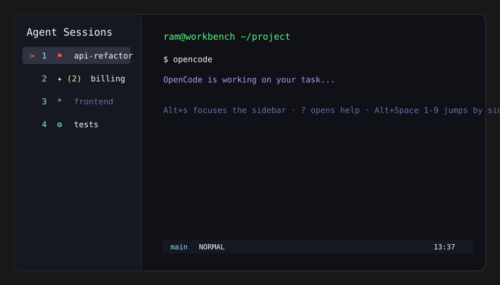

# zellij-agent-session-manager

Agent-focused session manager/sidebar for Zellij.

This treats one Zellij session as a workbench and each Zellij tab as a task/session. A persistent left sidebar shows tabs, promotes unread tabs into an alert section, and integrates with OpenCode so agent states are visible at a glance.



## Features

- Persistent Zellij sidebar per tab.
- Zellij tabs act as task/session rows.
- Alert rows are ordered above normal tabs.
- `Alt+Space` then `1-9` can jump by sidebar visual order.
- Generic terminal command completion alerts when a command finishes while its tab is unfocused.
- OpenCode-specific alert markers:
  - `⚑` OpenCode needs input.
  - `✦` OpenCode answer is ready / idle.
  - `⚙` generic terminal command finished.
- `?` help view inside the sidebar.

## Requirements

- Zellij `0.44.x` or compatible.
- Rust toolchain with `wasm32-wasip1` target for building.
- OpenCode if you want OpenCode-specific agent alerts.

Install Rust target:

```sh
rustup target add wasm32-wasip1
```

## Install

```sh
git clone <repo-url> zellij-agent-session-manager
cd zellij-agent-session-manager
./scripts/install.sh
```

The install script:

- Builds both WASM plugins.
- Copies them to `~/.config/zellij/plugins/`.
- Copies the sample layout to `~/.config/zellij/layouts/agent-session-manager.kdl`.
- Copies the OpenCode plugin to `~/.config/opencode/plugins/zellij-sidebar-alerts.js`.

Then merge these snippets into your Zellij config:

- `zellij/snippets/plugins.kdl`
- `zellij/snippets/keybinds.kdl`

Finally, start Zellij with:

```sh
zellij --layout agent-session-manager
```

Or set this layout as your default:

```kdl
default_layout "agent-session-manager"
```

## Zellij Permissions

The plugins will ask for permissions. Grant them.

The store plugin needs:

- `ReadApplicationState`
- `ChangeApplicationState`
- `ReadCliPipes`
- `MessageAndLaunchOtherPlugins`

The sidebar plugin needs:

- `ReadApplicationState`
- `ChangeApplicationState`
- `ReadCliPipes`
- `MessageAndLaunchOtherPlugins`

## Sidebar Keys

When focused on the sidebar:

```text
j/k or arrows  move selection
Enter          focus selected tab
c              clear selected alert
b              collapse sidebar
q or Esc       return to last work pane
?              show/close help
```

Global bindings from the snippet:

```text
Alt+s          focus sidebar
Alt+b          collapse/expand sidebar
Alt+Space 1-9  jump by sidebar visual order
```

## How Alerts Work

The store plugin owns alert state. Sidebar instances render state from the store.

Generic terminal command alerts come from Zellij `CommandChanged` events:

```text
foreground command starts -> tracked
foreground command returns to shell while tab is unfocused -> ⚙ alert
```

OpenCode alerts come from `opencode/plugins/zellij-sidebar-alerts.js`:

```text
question.asked -> ⚑ waiting/input needed
session.idle   -> ✦ answer ready
```

Alerts clear when visiting/focusing the tab.

## Build Only

```sh
./scripts/build.sh
```

Build artifacts are written to `dist/`:

```text
dist/zellij-agent-session-manager.wasm
dist/zellij-agent-session-manager-store.wasm
```

## Notes

- Restart Zellij after changing plugin aliases, keybinds, or `load_plugins`.
- Restart OpenCode after installing/updating the OpenCode plugin.
- The sample layout assumes a `zjstatus` plugin alias exists. Replace it with `zellij:status-bar` or your preferred status plugin if needed.
